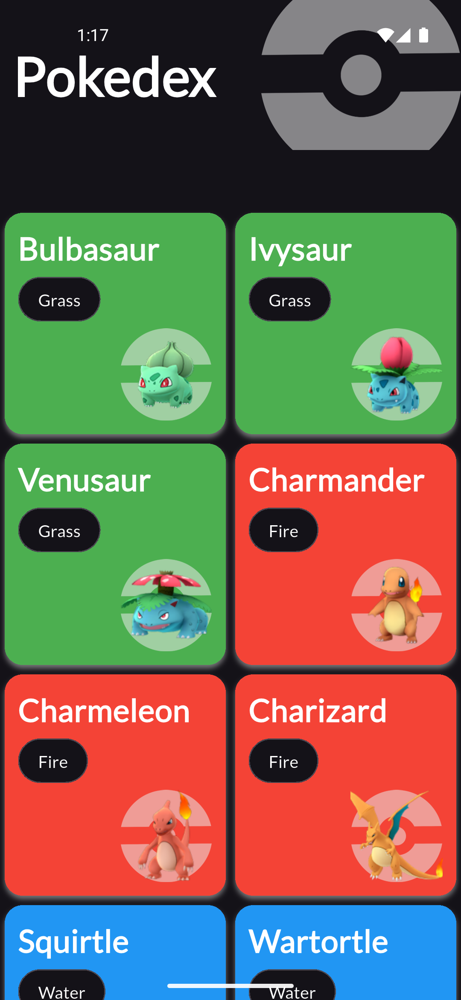
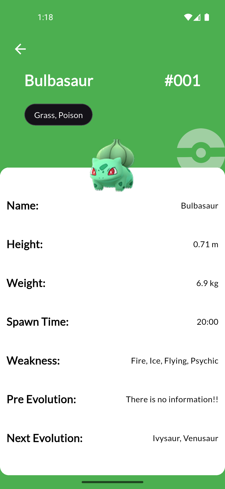

# Pokedex

A Flutter application that displays Pokemon information using the PokeAPI. Browse through Pokemon, view their details, types, and stats in a beautiful and intuitive interface.

## Screenshots

<div align="center">
  
  
  
</div>

## Features

- 📱 **Pokemon List**: Browse through all Pokemon with infinite scroll
- 🔍 **Search**: Find Pokemon by name or number
- 📊 **Detailed Info**: View Pokemon stats, types, abilities, and evolution chain
- 🎨 **Beautiful UI**: Pokemon-themed design with dynamic colors
- 📱 **Responsive**: Works on both phones and tablets
- 🌐 **Real-time Data**: Fetches data from PokeAPI
- ⚡ **Fast Loading**: Optimized image loading and caching

## Tech Stack

- **Flutter** - Cross-platform mobile framework
- **Dart** - Programming language
- **PokeAPI** - RESTful Pokemon data API
- **HTTP** - For API requests
- **Cached Network Image** - Image caching
- **Provider** - State management

## Getting Started

### Prerequisites

- Flutter SDK (>=3.0.0)
- Dart SDK (>=3.0.0)
- Android Studio / VS Code
- iOS Simulator / Android Emulator

### Installation

1. **Clone the repository**
```bash
git clone https://github.com/yourusername/pokedex.git
cd pokedex
```

2. **Install dependencies**
```bash
flutter pub get
```

3. **Run the app**
```bash
flutter run
```

### Build for Release

**Android APK:**
```bash
flutter build apk --release
```

**iOS:**
```bash
flutter build ios --release
```

## Project Structure
